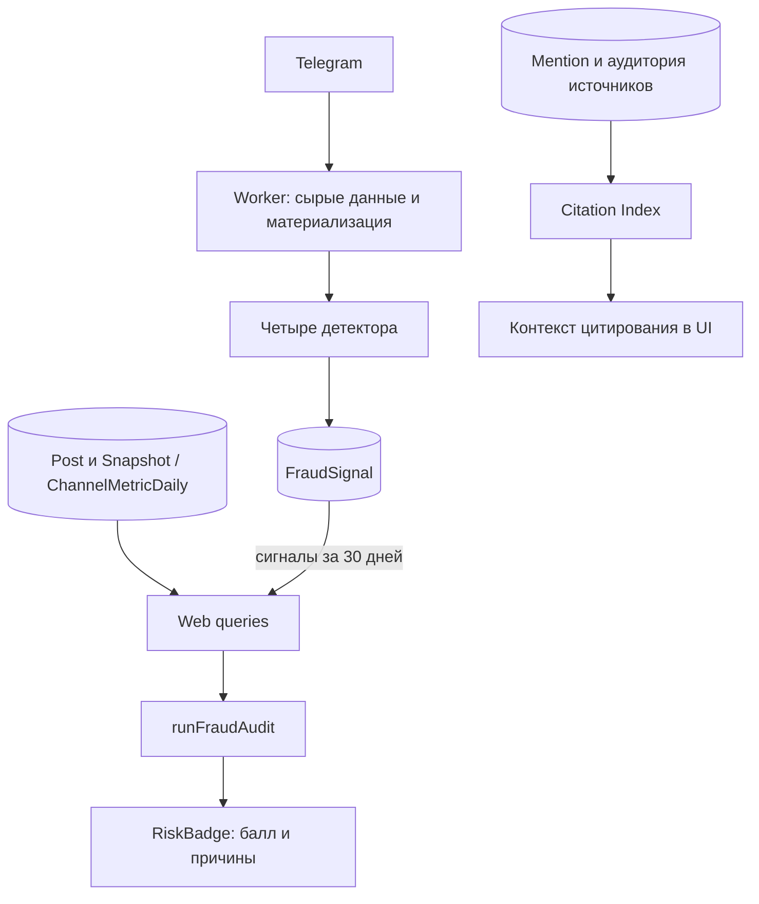

# ADR 0001: фоновые сигналы антифрода и аудит при чтении

**Статус:** реализовано, описание актуализировано по коду 17 сентября 2026 года.

**Область:** [fraudDetector.ts](../../src/lib/fraudDetector.ts), [citationIndex.ts](../../src/lib/citationIndex.ts), [collector.ts](../../src/worker/collector.ts), [persister.ts](../../src/worker/persister.ts), [queries.ts](../../src/lib/metrics/queries.ts), [RiskBadge.tsx](../../src/components/RiskBadge.tsx).

## Контекст

TgMon располагает неполными наблюдениями Telegram: аудитория, счётчики постов и упоминания из отслеживаемых источников. Интерфейсу нужны объяснимые сигналы необычного поведения и единая краткая оценка. Из этих данных нельзя достоверно установить покупку трафика или оценить её вероятность без дополнительной проверки.

## Решение

1. Чистые детекторы вычисляют четыре типа аномалий и текст причины.
2. Основной worker после материализации запускает проверки и записывает сработавшие FraudSignal. Весь блок защищён общим try/catch: ошибка не отменяет сбор канала, но может пропустить оставшиеся проверки в этом блоке.
3. Web query layer читает сигналы за 30 дней и вызывает `runFraudAudit`. По каждому типу сохранённое срабатывание имеет приоритет перед вычислением на переданной выборке. Сам runFraudAudit к БД не обращается.
4. Каждый сработавший тип даёт 25 баллов. RiskBadge показывает 0 зелёным, 1–49 янтарным, ≥50 розовым и перечисляет причины в подсказке.
5. CI и checkLowCitationGrowth выводятся как отдельный контекст; они не добавляют пятое слагаемое в fraudScore.

## Пороговые значения реализации

| Проверка | Условие |
| --- | --- |
| Гладкость роста | ≥14 точек, положительное среднее дельт, CV<0.1 |
| Просмотры / аудитория | ≥5 постов с views>0, положительная аудитория; ratio<0.05 или >1.5 |
| Скачок без событий | ≥2 точки; delta>max(3×среднее **всех** дельт, 50, 0.005×maxFollowers), нет постов/упоминаний в день скачка и предыдущий день |
| Равномерность ERR | До 20 последних валидных ERR, ≥10 значений, среднее>0, CV<0.1 |
| Низкое цитирование при росте | delta30d.percent>5 и CI≤1; вне fraudScore |

Полные формулы и окна — в [analytics-formulas.md](../analytics-formulas.md). Это эвристические константы кода. В репозитории нет измерений, подтверждающих их точность или универсальность для всех ниш. Предыдущие категоричные трактовки «доказательство накрутки» и неподтверждённые нормативы естественной волатильности не описывают возможности реализации.

## Сохранение и интерпретация

FraudSignal хранит channelId, signalType, value, reason, detectedAt. Срабатывания записываются повторно при новых циклах; уникального ключа по типу/дню и снятия сигнала нет. При чтении тип даёт максимум 25 баллов независимо от числа записей, но может удерживать балл в течение окна 30 дней.

Недостаток данных возвращает flag=false. У RiskBadge нет отдельного состояния «недостаточно данных»: 0 (включая fallback при отсутствии score) означает отсутствие учитываемых срабатываний, а не подтверждение чистоты аудитории. Надпись с процентом отражает дискретный балл, не обученную вероятность.

## Компромиссы и ограничения

- Фоновая запись не добавляет операции сохранения сигналов в каждое чтение страницы, но исторический сигнал может пережить исходную аномалию.
- Чистые функции позволяют проверять граничные случаи unit-тестами; это не измерение качества детекции на реальных каналах.
- Overview использует дневные метрики и посты за 7 дней; detail может передать внутридневные снимки за выбранный период. Проверка гладкости считает точки, не уникальные дни, поэтому окна не эквивалентны.
- Web-аудит не получает даты упоминаний из query layer. Фоновая проверка получает Mention.createdAt, которое обновляется при пересоздании упоминаний. Корреляция не является полной историей внешнего трафика.
- CI ограничен источниками, собранными в этой БД. Внешняя реклама и ненаблюдаемые каналы могут объяснять рост при низком CI. Ошибки helpers также способны дать CI=0.
- Производительность runFraudAudit не подтверждена бенчмарком в этой документации; прежнее обещание «<2 мс» не используется.

## Альтернативы и последствия

Вместо текущих правил возможны обученный классификатор, непрерывные веса и пересчёт всех сигналов при каждом чтении. Они потребовали бы отдельного решения о данных для валидации, объяснимости и стоимости вычислений; в текущем коде их нет.

Сохраняется простая аддитивная шкала с доступной причиной каждого флага. Изменение порогов или снятие исторических сигналов меняет продуктовый смысл балла и должно сопровождаться тестами, актуализацией формул и проверкой совместимости сохранённых FraudSignal. Текущие тесты: `src/lib/__tests__/fraudDetector.test.ts`, `citationIndex.test.ts`, `src/components/__tests__/RiskBadge.test.ts`.
