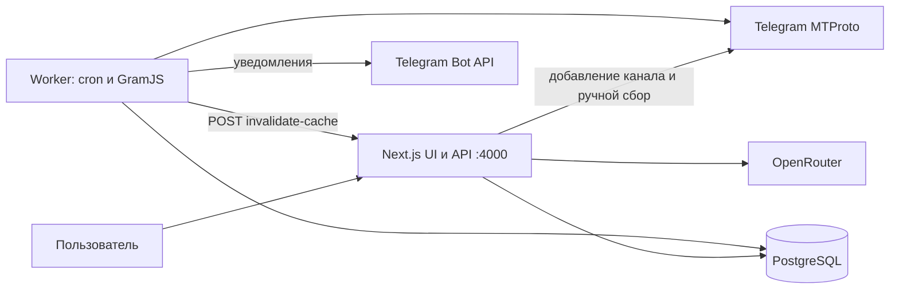
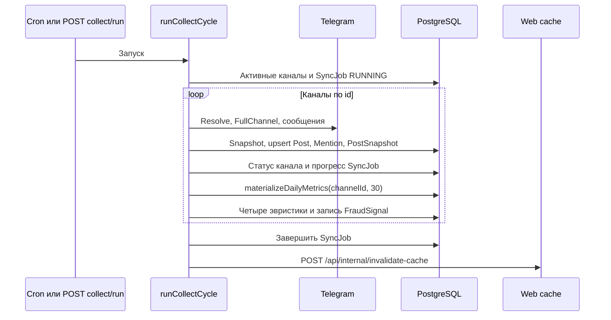

# Архитектура TgMon

Состояние реализации: 20 сентября 2026 года. Источники — [Prisma-схема](../prisma/schema.prisma), [база данных](database.md), [worker](../src/worker/index.ts), [коллектор](../src/worker/collector.ts), [запросы метрик](../src/lib/metrics/queries.ts) и [Compose](../docker-compose.yml).

## Контекст и процессы

Web и worker — отдельные Node.js-процессы с общими модулями и БД. При этом web тоже импортирует коллектор: добавление канала выполняет resolve/backfill, а `POST /api/collect/run` ждёт завершения `runCollectCycle` непосредственно в web-процессе. Очереди задач и отдельного HTTP-сервера worker нет.

`src/worker/index.ts` защищает каждое cron-задание своим флагом от повторного запуска того же задания внутри процесса. Межпроцессной блокировки нет; основной сбор, демография, рекламный сбор и ручной HTTP-вызов могут пересекаться. Несколько worker требуют отдельной координации.

## Слои приложения

| Слой | Модули и ответственность |
| --- | --- |
| UI | `src/app/`, `src/components/`: страницы, интерактивные таблицы, графики, отчёты; главная и детализация загружают метрики через API |
| API | `src/app/api/`: чтение и управление каналами, статистика, AI, события, настройки, health, экспорт |
| Метрики | `src/lib/metrics/queries.ts`, `aggregate.ts`, `calculate.ts`, `engagement.ts`, `adShare.ts`; публичные реэкспорты в `src/lib/metrics.ts` |
| Производные оценки | `ep.ts`, `scoring.ts`, `fraudDetector.ts`, `citationIndex.ts`, `pricing.ts` |
| Сбор | `client.ts` → `fetcher.ts` → `collector.ts` → `persister.ts`; обработка ошибок в `retry-policy.ts` |
| Дополнительные задания | `worker/demographics.ts`, `worker/ad-reach.ts` |
| Хранение и кэш | `prisma.ts`, `materialize.ts`, `cache.ts` |

## Модель данных

Полная спецификация моделей PostgreSQL 15, типов полей, вторичных индексов, перечислений и каскадов приведена в документе [База данных и схема Prisma](database.md).

Схема `prisma/schema.prisma` включает **15 моделей** и перечисление **`SyncStatus`** (`RUNNING`, `COMPLETED`, `PARTIAL`, `FAILED` — статус фонового цикла сбора в `SyncJob`):

| Prisma-модель | Таблица | Назначение |
| --- | --- | --- |
| `Channel` | `channels` | Идентификаторы Telegram, тип, ниша, флаги, статус и ошибки сбора |
| `Snapshot` | `snapshots` | История численности аудитории |
| `Post` | `posts` | Текущие счётчики и текст публикации; unique `(channelId, messageId)` |
| `PostSnapshot` | `post_snapshots` | Нерегулярная история просмотров свежих постов для LTV |
| `PostViewSnapshot` | `post_view_snapshots` | Рекламные контрольные точки; unique `(postId, hoursAfterPost)` |
| `Mention` | `mentions` | Ссылка из собранного поста на username/tgId; target не является внешним ключом на Channel |
| `SyncJob` | `sync_jobs` | Начало/конец цикла, статус (`SyncStatus`), счётчики и краткая ошибка |
| `ChannelMetricDaily` | `channel_metrics_daily` | Дневные агрегаты UTC; unique `(channelId, date)` |
| `AudienceDemographics` | `audience_demographics` | Языковые доли, дата снимка, nullable JSONB `countryBreakdown` |
| `AiReport` | `ai_reports` | Тип и строковый JSON-ответ LLM, необязательный канал |
| `Event` | `events` | Мероприятия и события, извлечённые из публикаций Telegram |
| `EventMention` | `event_mentions` | Связи M:N событий с исходными постами; unique `(eventId, postId)` |
| `SystemSetting` | `system_settings` | Запись `global` с настройками AI и полями digest |
| `AlertRule` | `alert_rules` | Схема пользовательских правил; исполнения в worker пока нет |
| `FraudSignal` | `fraud_signals` | Тип, значение, причина и время срабатывания эвристики |

Миграции находятся в `prisma/migrations/`. Последняя на дату сверки — `20260916213000_add_demographics_country`: добавление nullable JSONB без заполнения старых строк. `PostViewSnapshot` введён миграцией `20260913211244_add_post_view_snapshot`. Схема включает `pg_trgm` и GIN-индекс текста постов.

Отключение канала меняет `isActive`; физическое удаление использует каскады связей Prisma. `isMine` переносится транзакцией, но уникального ограничения в БД нет. `SystemSetting.aiToken` хранится и возвращается без маскирования. Параметры digest и `AlertRule` сами по себе не включают фоновые функции.

## Основной цикл сбора

1. Первый сбор получает до 1000 сообщений и оставляет последние 30 дней; последующие циклы перечитывают до 200 последних сообщений без `min_id`. `lastMessageId` хранит максимум, но не ограничивает текущий запрос.
2. FullChannel даёт число участников. При изменении названия оно обновляется; отдельного суточного задания метаданных нет. Ошибка FullChannel может оставить доступный fallback-счётчик, таймаут передаётся выше.
3. При изменении аудитории относительно предыдущего снимка на ≥1% по модулю **или** ≥500 участников отправляется опциональное Bot API-уведомление.
4. Альбомы сводятся к существующему посту с тем же `groupedId`. Upsert обновляет известные счётчики/текст, а `subscribersAtPublish` задаёт только при создании. Для backfill это число участников во время сбора.
5. Для постов моложе 7 суток с известными просмотрами создаётся `PostSnapshot`. Эти снимки не дедуплицируются по циклу. Упоминания при непустом новом списке удаляются и создаются заново; `createdAt` отражает время записи, не исходную дату публикации.
6. `postsAdded` увеличивается на обработанное сообщение, включая обновления и части альбомов. Это не число новых уникальных строк Post.
7. Материализация пересчитывает 30 календарных UTC-дней; её ошибка логируется отдельно. Затем общий `try/catch` обрабатывает блок антифрода: сбой в нём может пропустить оставшиеся проверки канала, но не отменяет сбор.

`fetcher.ts` делает паузу 1000–1299 мс перед попыткой и до трёх попыток при FLOOD_WAIT. Ожидание — указанное Telegram время + 2 секунды + jitter до 1499 мс; экспоненциального backoff в этом коде нет. Это задержка на вызов, а не распределённый глобальный rate limiter.

`retry-policy.ts` увеличивает `consecutiveErrors` и отключает канал при достижении `CHANNEL_MAX_CONSECUTIVE_ERRORS` (по умолчанию 10). Успех сбрасывает счётчик. При `TelegramTimeoutError` цикл пытается переподключить клиент; неудачный reconnect завершает цикл с fatal error. Некоторые ошибки чтения сообщений внутри `collectChannelData` только логируются, поэтому успешный статус не гарантирует полноту постов.

## Материализация, API и кэш

API предпочитает `ChannelMetricDaily`, если за период есть хотя бы одна строка; иначе использует сырые Snapshot/Post. Worker рассчитывает дневные агрегаты, web — сводные метрики, EP, Content Score, CI и динамический антифрод. Это не модель «worker только пишет сырые данные».

`metricsCache` живёт 5 минут, `bestTimeCache` — 30 минут. Кэш находится в памяти одного процесса. API добавления, PATCH/DELETE канала, ручного сбора и внутренней инвалидации очищают оба кэша. PUT избранного их не очищает. Перезапуск процесса очищает кэш; общего кэша между репликами нет.

В `finally` основного цикла worker отправляет запрос на `WEB_INTERNAL_URL` с `COLLECT_API_TOKEN`, если оба заданы. Сетевое исключение логируется; текущий caller не проверяет HTTP-статус ответа. Запись об успешной инвалидации в логе поэтому не гарантирует HTTP 200.

## Антифрод

Worker анализирует до 30 дневных строк и до 30 последних постов, сохраняет только сработавшие сигналы. При чтении overview/detail web загружает сигналы за 30 дней и вызывает чистую функцию `runFraudAudit`; сама она не читает БД. Сохранённый сигнал соответствующего типа имеет приоритет перед повторным вычислением этого типа.

При отсутствии сохранённых сигналов расчёт использует переданные данные. Overview передаёт посты за 7 дней и дневные метрики за 30 дней; detail — последние 20 постов (либо recentPosts при короткой выборке) и сырую историю аудитории выбранного периода. Даты упоминаний эти вызовы не передают, поэтому динамическая проверка скачков не эквивалентна фоновой. [Формулы и ограничения](analytics-formulas.md), [ADR](adr/0001-anti-fraud-detection-architecture.md).

## Демография и рекламный охват

- Демография: `DEMOGRAPHICS_CRON`, default `0 3 * * 0`; только активные `isMine` broadcast-каналы без успешного снимка с начала текущей недели (воскресенье 00:00 по часовому поясу процесса). Проверка `canViewStats`, вызовы GetBroadcastStats/LoadAsyncGraph в `statsDc`, разбор последней общей точки. Ошибки изолированы от основного сбора. `countryBreakdown` остаётся SQL NULL.
- Рекламный охват: фиксированный cron `15 * * * *`, посты с `isAd: true` не старше 50 часов. Фильтра `channel.isActive` здесь нет. Проверяются отсутствующие точки 1/12/24/48 часов с допуском 5 минут до срока. Все просроченные точки получают текущие просмотры; фактическое время хранится в `capturedAt`.
- Дополнительные задания не запускаются автоматически при старте: `COLLECT_ON_STARTUP` относится только к основному циклу.

Cron и часть heatmap используют часовой пояс Node.js-процесса; материализация использует UTC. Явного timezone в `cron.schedule` нет.

## AI, события и граница доступа

AI-обработчики формируют промпты из сохранённых данных, вызывают `callOpenRouter` и пытаются сохранить ответ через `saveAiReport`. Восемь типов отчётов описаны в [API](api-reference.md). Для анализа рыночных трендов (`/api/ai/trends`) посты отбираются исключительно из активных каналов (`isActive: true`), входящих в Watchlist (`isFavorite: true`) или являющихся «Моим каналом» (`isMine: true`) за последние 48 часов с непустым текстом (до 100 публикаций). Event Scanner отдельно извлекает события из текстов и связывает их с Post. Данные контента отправляются внешнему провайдеру при запуске этих функций.

`callOpenRouter` читает `OPENROUTER_API_KEY`; `SystemSetting` не участвует в выборе провайдера, токена или модели. Экспорт отчёта возвращает HTML, а PDF/PNG формируют соответствующие компоненты интерфейса.

`verifyBearerToken` проверяет заголовок в большинстве мутаций, но middleware предварительно добавляет его всем мутациям без Authorization. Проверки сессии, Origin или пользователя нет; `/api/settings` и `/api/events/scan` не вызывают verifier. Это требует внешнего ограничения доступа при сетевом размещении. [Эксплуатация](deployment.md).
