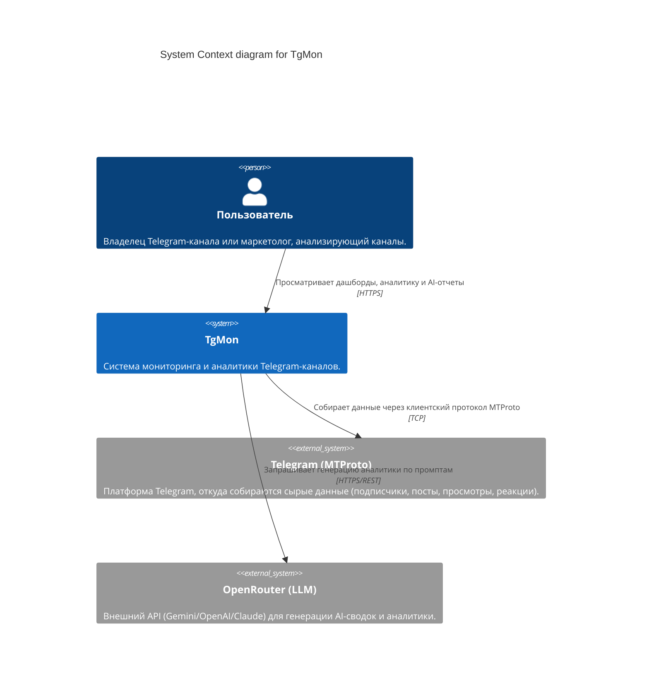
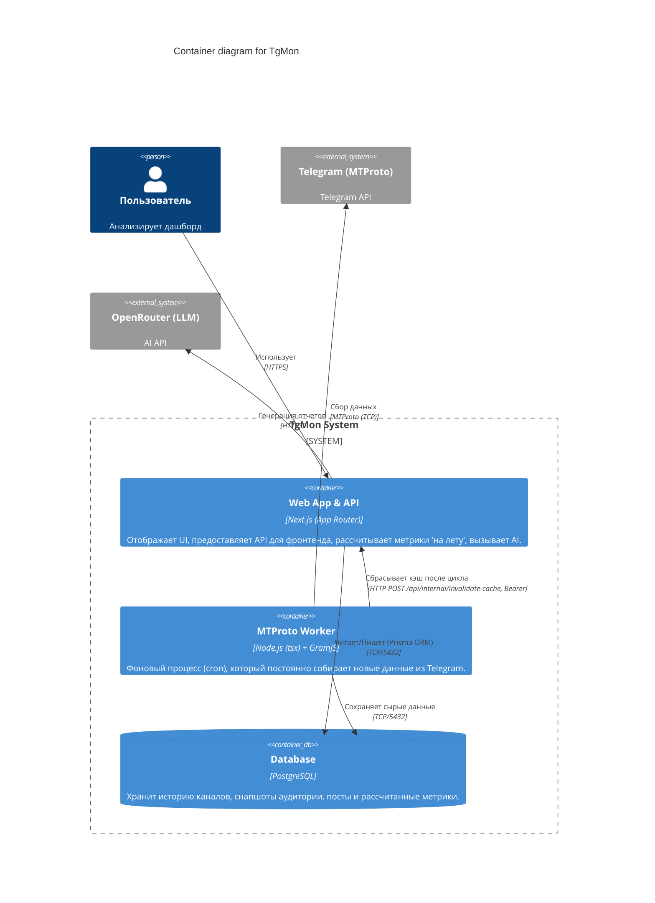
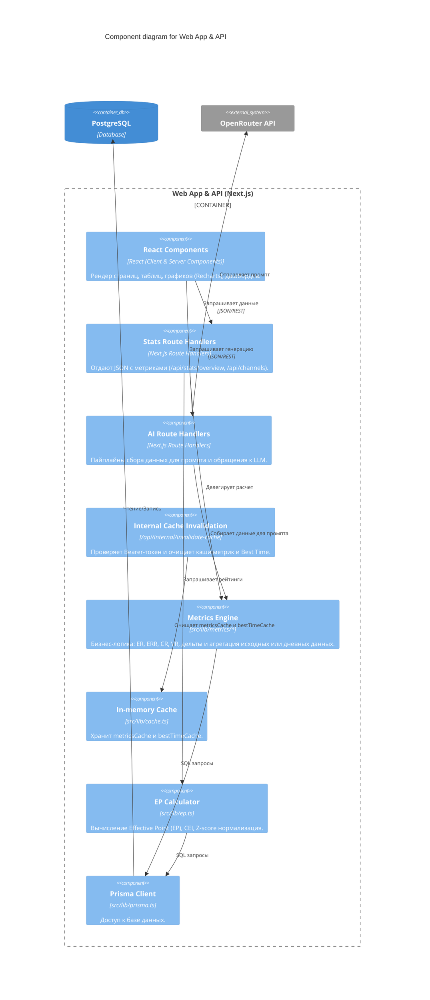
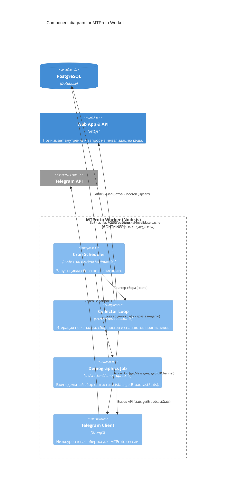

# Архитектура проекта TgMon (C4 Model)

Этот документ описывает высокоуровневую архитектуру проекта TgMon, включая основные компоненты, их взаимодействие и внешние зависимости. Архитектура описана с использованием диаграмм C4 (Context, Container, Component).

## 1. System Context Diagram

Диаграмма контекста показывает систему TgMon в целом и ее взаимодействие с внешними системами и пользователями.

## 2. Container Diagram

Диаграмма контейнеров раскрывает внутреннюю структуру системы TgMon на уровне развертываемых единиц (контейнеров).

## 3. Component Diagram (Web App & API)

Эта диаграмма детализирует внутреннюю структуру Next.js приложения.

## 4. Component Diagram (Worker)

Детализация фонового сборщика.

## Поток инвалидации кэша

После завершения `runCollectCycle` worker берёт `WEB_INTERNAL_URL` и `COLLECT_API_TOKEN` из окружения и отправляет `POST /api/internal/invalidate-cache` с Bearer-токеном. Маршрут веб-процесса очищает `metricsCache` и `bestTimeCache`. Ошибка этого HTTP-вызова логируется в worker и не отменяет завершённый цикл сбора.
