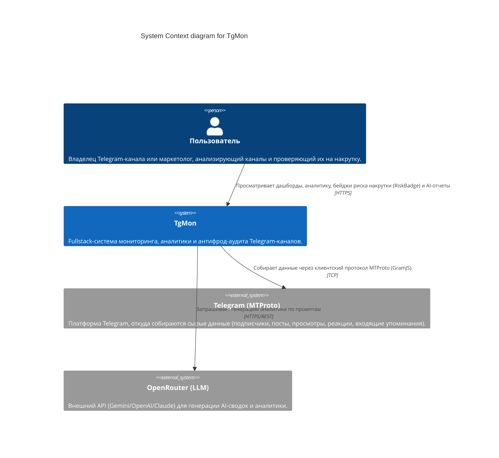
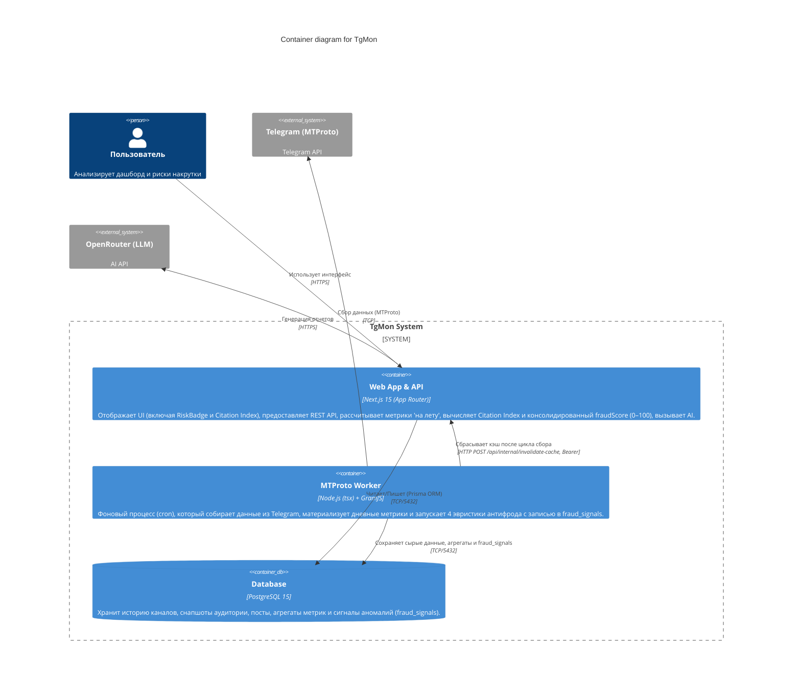
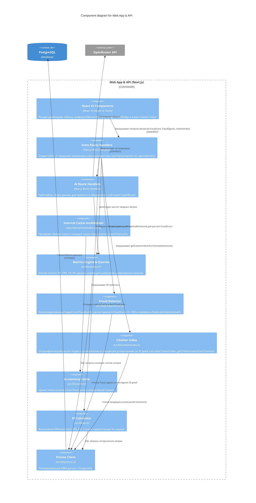
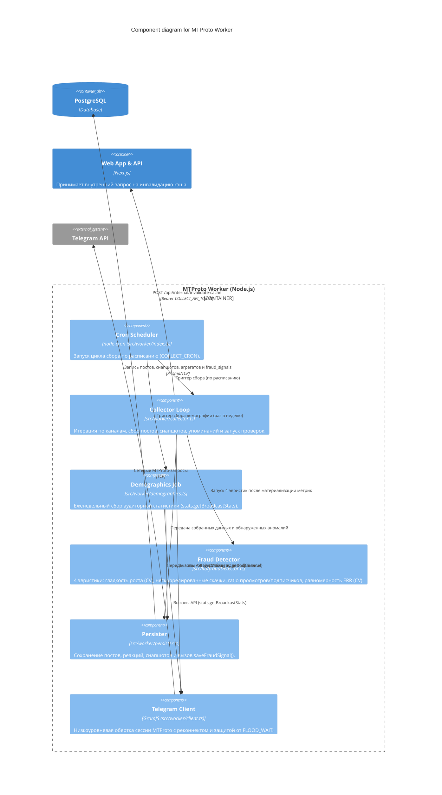
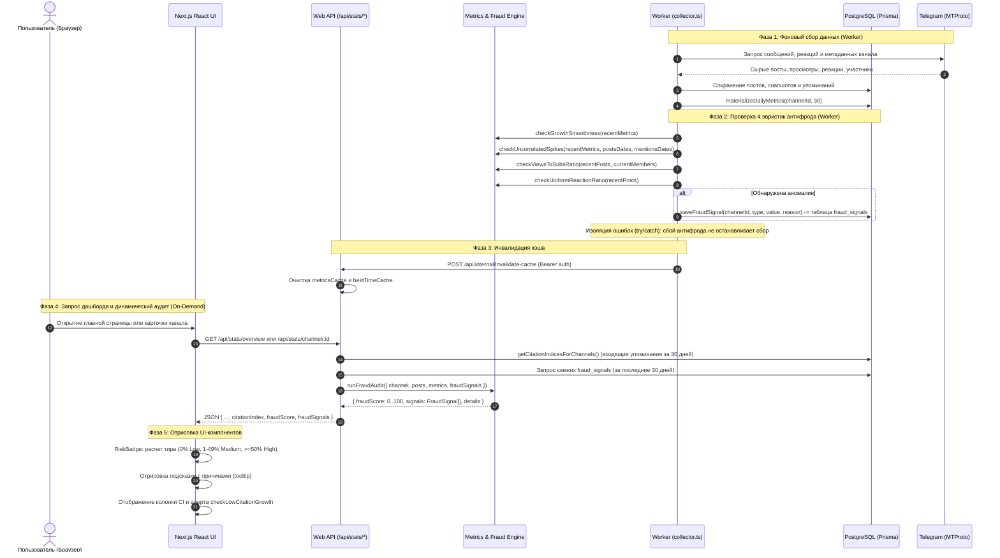

# Архитектура проекта TgMon (C4 Model)

Этот документ описывает высокоуровневую архитектуру проекта TgMon, включая основные компоненты, их взаимодействие, пайплайн антифрод-мониторинга и внешние зависимости. Архитектура описана с использованием диаграмм C4 (Context, Container, Component) и Mermaid-схем.

## 1. System Context Diagram

Диаграмма контекста показывает систему TgMon в целом и ее взаимодействие с внешними системами и пользователями.



## 2. Container Diagram

Диаграмма контейнеров раскрывает внутреннюю структуру системы TgMon на уровне развертываемых единиц (контейнеров).



## 3. Component Diagram (Web App & API)

Эта диаграмма детализирует внутреннюю структуру Next.js приложения, включая модули аналитики и антифрод-скоринга.



## 4. Component Diagram (Worker)

Детализация фонового процесса сбора данных и детекции аномалий.



## 5. Пайплайн сбора данных и антифрод-аудита (Data Pipeline & Anti-Fraud Flow)

Сквозной процесс обработки данных объединяет сбор в MTProto Worker, материализацию, фоновую фиксацию сигналов накруток, инвалидацию кэша и динамический аудит при запросах через Web API.



## 6. Поток инвалидации кэша

После завершения `runCollectCycle` worker берёт `WEB_INTERNAL_URL` и `COLLECT_API_TOKEN` из окружения и отправляет `POST /api/internal/invalidate-cache` с Bearer-токеном. Маршрут веб-процесса очищает `metricsCache` и `bestTimeCache`. Ошибка этого HTTP-вызова логируется в worker и не отменяет завершённый цикл сбора.

## 7. Архитектура антифрода и оценка риска накрутки (Risk of Artificial Traffic)

Антифрод-система TgMon спроектирована по двухуровневой гибридной схеме:

### 7.1 Фоновый уровень детекции (Worker Heuristics & Persistence)
В фоновом цикле `src/worker/collector.ts` после материализации дневных метрик (`materializeDailyMetrics`) автоматически запускаются 4 независимые эвристические проверки:

1. **Гладкость роста аудитории (`checkGrowthSmoothness`)**:
   - Анализирует ежедневные дельты подписчиков за последние $\ge 14$ дней.
   - Вычисляет коэффициент вариации $CV = \sigma / \mu$.
   - Если $CV < 0.1$ (колебания прироста менее 10%), фиксируется неестественно прямолинейный рост (характерно для бот-ферм с фиксированной суточной нормой).
2. **Нескоррелированные скачки подписчиков (`checkUncorrelatedSpikes`)**:
   - Динамический порог всплеска: $\text{threshold} = \max(3\overline{\Delta}, 50, 0.005 \times N_{followers})$.
   - Проверяет окно $[T-1, T]$ вокруг даты скачка: если в этот период не было ни публикаций новых постов, ни входящих упоминаний/репостов из других каналов, скачок помечается как аномальный.
3. **Соотношение просмотров к подписчикам (`checkViewsToSubsRatio`)**:
   - Анализирует последние посты (требуется $\ge 5$ постов с просмотрами).
   - Вычисляет отношение $\text{ratio} = \overline{\text{views}} / \text{members}$.
   - Флаг срабатывает при $\text{ratio} < 0.05$ (менее 5% просмотров — подозрение на "мертвых" ботов) или при $\text{ratio} > 1.5$ (более 150% просмотров — подозрение на накрутку просмотров).
4. **Шаблонность вовлеченности / Равномерность ERR (`checkUniformReactionRatio`)**:
   - Анализирует последние 15–20 постов (требуется $\ge 10$ постов).
   - Для каждого поста вычисляет $ERR = \frac{\text{reactions} + \text{comments} + \text{forwards}}{\text{views}} \times 100$.
   - Рассчитывает коэффициент вариации $CV_{ERR} = \sigma_{ERR} / \mu_{ERR}$.
   - Флаг срабатывает при $CV_{ERR} < 0.1$, выявляя роботизированные накрутки реакций со стабильным соотношением.

**Изоляция ошибок:** Весь блок проверок в worker обернут в `try { ... } catch (fraudErr)` с логированием через `logger.error('Fraud detection failed', ...)`. Сбой антифрода ни при каких обстоятельствах не нарушает основной цикл сбора данных Telegram.

**Персистентность (`fraud_signals`):** При срабатывании любой эвристики вызывается функция `saveFraudSignal(channelId, signalType, value, reason)` (`src/worker/persister.ts`), создающая запись в PostgreSQL таблице `fraud_signals` через модель `FraudSignal`:
```prisma
model FraudSignal {
  id         Int      @id @default(autoincrement())
  channelId  Int      @map("channel_id")
  signalType String   @map("signal_type")
  value      Float
  reason     String
  detectedAt DateTime @default(now()) @map("detected_at")
  channel    Channel  @relation(fields: [channelId], references: [id], onDelete: Cascade)

  @@index([channelId, detectedAt])
  @@map("fraud_signals")
}
```

### 7.2 Слой Web API, Индекс цитирования и On-Demand аудит
На уровне веб-сервера (`src/lib/metrics/queries.ts`) при формировании дашборда (`getChannelsOverview`) и детальной карточки (`getChannelDetailStats`) выполняется синтез метрик в реальном времени:

1. **Индекс цитирования (`src/lib/citationIndex.ts`)**:
   - Рассчитывается логарифмический индекс по формуле:
     $$\text{CitationIndex} = \sum_{m \in \text{mentions}} \left( \text{count}_m \times \log_{10}(\text{citing\_subscribers}_m) \right)$$
   - Учитываются только входящие упоминания за последние 30 дней.
   - Исключаются самоцитирования (`sourceChannelId !== targetChannelId`).
   - Для каналов с числом подписчиков $\le 1$ вес приравнивается к 0.
   - Пакетная выборка для таблиц выполняется функцией `getCitationIndicesForChannels(channels, dateLimit)`.
2. **Проверка низкого цитирования (`checkLowCitationGrowth`)**:
   - Если канал вырос более чем на 5% за 30 дней, но его индекс цитирования $\le 1$, канал помечается подозрением на накрутку мотивированным трафиком без органического присутствия в инфополе Telegram.
3. **Консолидированный скоринг (`runFraudAudit`)**:
   - Объединяет 4 базовых эвристических сигнала (`views_to_subs_ratio`, `growth_smoothness`, `uncorrelated_spikes`, `uniform_err`).
   - Функция поддерживает гибридный режим: проверяет как сохраненные в БД записи `fraud_signals` за 30 дней, так и динамически вычисляет флаги по переданным массивам постов и метрик (критично для только что добавленных каналов).
   - Вычисляет единый показатель `fraudScore` от 0 до 100:
     $$\text{fraudScore} = \text{triggeredCount} \times 25$$
     Возможные значения: $0, 25, 50, 75, 100$.

### 7.3 Представление в UI: RiskBadge и индикаторы цитирования
Результаты антифрод-аудита выводятся пользователю через компонент `RiskBadge` (`src/components/RiskBadge.tsx`), а также специальные ячейки таблиц и карточек:

- **Бейдж риска (`RiskBadge` / `FraudScoreBadge`)**:
  - Текст: `Risk of Artificial Traffic: {safeScore}%`.
  - 3 градации серьезности (severity tiers):
    - **Низкий риск (Low Risk, score = 0)**: стиль `bg-emerald-500/15 text-emerald-400 border-emerald-500/30`, иконка `<ShieldCheck className="w-3.5 h-3.5" />`, всплывающая подсказка `Risk of Artificial Traffic: 0% (Низкий риск накрутки)`.
    - **Средний риск (Medium Risk, 1 <= score < 50)**: стиль `bg-amber-500/15 text-amber-400 border-amber-500/30`, иконка `<AlertTriangle className="w-3.5 h-3.5" />`, всплывающая подсказка со списком сработавших факторов накрутки.
    - **Высокий риск (High Risk, score >= 50)**: стиль `bg-rose-500/15 text-rose-400 border-rose-500/30`, иконка `<AlertTriangle className="w-3.5 h-3.5" />`, всплывающая подсказка со списком всех обнаруженных аномалий.
  - Размещение:
    - `MyChannelCard.tsx`: в строке статусов карточки «Мой канал».
    - `ChannelHeader.tsx`: в верхней панели детальной страницы канала.
    - `ChannelsMobileList.tsx`: в заголовке мобильной карточки каждого канала.
- **Отображение индекса цитирования**:
  - `ChannelsDesktopTable.tsx`: сортируемая колонка `CI`. При срабатывании `checkLowCitationGrowth` значение выводится розовым цветом с иконкой `<AlertTriangle />` и тултипом с описанием аномалии.
  - `MyChannelCard.tsx`: отдельная плашка «Индекс цит. (30д)» с иконкой `<Share2 />`, цветовой индикацией и предупреждением при низком цитировании.
